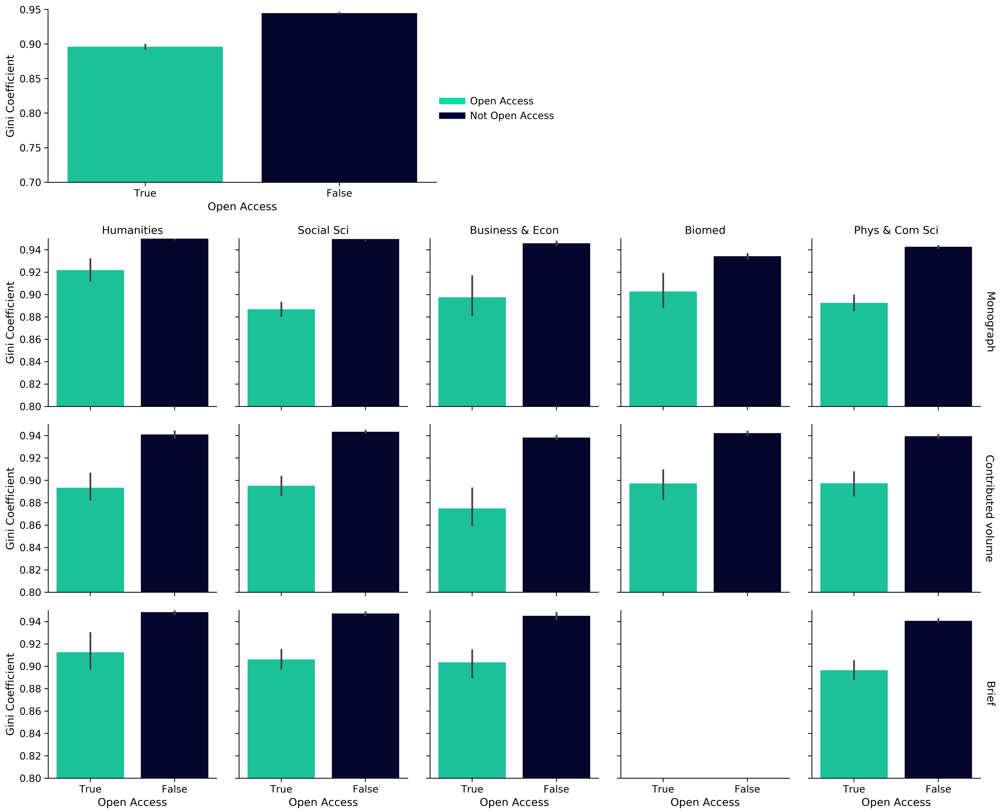
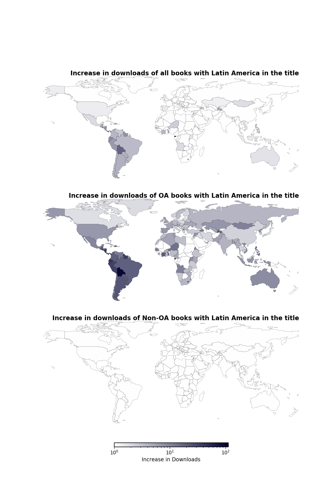
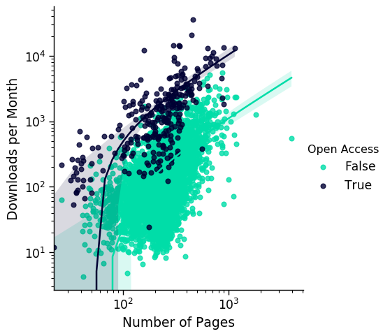

More readers in more places: The benefits of open access for scholarly books
============================================================================

Alkim Ozaygen^a^, Lucy Montgomery^a^, Cameron Neylon^a^, Chun-Kai (Karl) Huang^a^, Ros Pyne^b^, Christina Emery^b^ and Mithu Lucraft^b^

^a^Centre for Culture and Technology, School of Media, Creative Arts and Social Inquiry, Curtin University, Bentley 6102, Western Australia
^b^Springer Nature, 4 Crinan Street, London N1 9XW, UK

Abstract
--------

Open access to scholarly contents has grown substantially in recent years. This includes the number of books published open access online. However, there is limited study on how usage patterns (via downloads, citations and web visibility) of these books may differ from their closed counterparts. Such information is not only important for book publishers, but also for researchers in disciplines where books are the norm. This article reports on findings from comparing samples of books published by Springer Nature to shed light on differences in usage patterns across open access and closed books. The study includes a selection of 281 open access books and a sample of 3,653 closed books (drawn from 21,059 closed books using stratified random sampling). The books are stratified by combinations of book type, discipline and year of publication to enable likewise comparisons within each stratum and to maximise statistical power of the sample. The results show higher geographic diversity of usage, higher numbers of downloads and more citations for open access books across all strata. Importantly, open access books have increased access and usage for traditionally under-served populations.

*Keywords:* open access, books, Springer Nature, usage pattern, download, citation.

Introduction
------------

Open access (OA) to scholarly outputs has taken the central stage in recent years, with numerous international, regional and local initiatives leading the way in advancing rapid changes to the publishing landscape. Yet, despite the high volume of research available on journal articles (and academic outputs in general), relatively little has focused on OA books. In particular, there is limited information on the level of online usage, their geographic distribution and, importantly, how usage may be influenced by publishing books in OA forms. 

There are numerous potential proxies for measuring the usage of scholarly work. These include citations, downloads, website visits, social media mentions and their various forms. Through a randomised controlled trial, Davis, Simon & Connolly (2008) is able to show that OA articles have higher numbers of downloads and more unique web page visitors than non-OA articles^1^. Wang et al. (2015) further finds that the increased level of downloads for OA articles is sustained over time. This is found in addition to OA articles attracting more social media attention^2^. However, research also found the OA advantage of altmetric activities to have significant differences across disciplines^3^. The citation advantage of OA publishing remains a hotly debated issue. Although, a recent literature review shows there is relatively more research in support of the OA advantage, with the caveat that there may be a large variability across disciplines^4^.

Most of the above findings have a strong focus on journal articles. Yet, it remains unclear whether these results can be generalised to books. In particular, there are significant differences between journal articles and books in terms of how they are hosted, shared and used online, and how they can be identified and tracked^5^. These make the integration of usage data for books a challenging task. Counting Online Usage of Networked Electronic Resources (COUNTER) is an international effort to overcome some of these problems. It is a code of practice for compiling online usage statistics of electronic resources^6^. Benchmarking book usage levels is another important aspect to consider. Books with different attributes (such as different languages and research fields) can have vastly different target audiences. Hence, the ability to compare books with similar attributes is essential for deep understandings of book usage.

There is a limited amount of previous work comparing downloads of OA and non-OA books with the goal of understanding the impacts of OA on the geographies of usage. The work of Snjider (2013) showed increased usage for OA books as well as some evidence of an increase in sales^7^. Using a sample of 180 books Snijder (2013) showed that OA led to increased proportions of usage in developing countries as well as demonstrating a “digital divide” in discovery and use. 

This article, which extends the findings of Snijder (2013), provides a timely update to evidence-based arguments for the benefits of OA to scholarly books. Our analysis of a larger sample allows us to investigate these effects, particularly the geographic effects, in much greater detail. Using books available from a common source (i.e., Springer Nature) also alleviate some of the challenges discussed above. Having download data by month and various disciplines for all books allows us to confirm that downloads are higher for OA books across their whole history and across all disciplines. We also update analysis on the effects of OA across downloads, citations, and web visibility for a single large sample, following on the work undertaken by Springer Nature in 2017^8^.

Main findings
-------------

This article reports on the analysis of usage (with downloads, citations and web visibility as proxies) and related indicators for a sample of books that is stratified by mixtures of book type, discipline and year of publication. In particular, the analysis considers the geographic usage of OA and non-OA books, examining whether OA facilitates the takeup of books by countries or regions that are traditionally underrepresented in the production and use of scholarly content.

To the best of our knowledge, this is the largest independent analysis ever conducted on the usage of OA and non-OA books. The sample size and sampling procedure allow us to be significantly more confident that there are substantial effects connecting OA status with downloads and citations for this set of books. 

The main findings of our analysis are:

* OA books as a group show a higher geographic diversity of usage and reach more countries, i.e., they have a greater proportion of usage in a wider range of countries.
* OA books have increased access and usage for under-served populations and low or middle income countries, including a high number of countries from Africa.
* OA books as a group have ten times more downloads than non-OA books and more than double the number of citations.
* There is higher (at least 2.7-fold) usage (via downloads) of OA books across every stratum in our sample. That is for every type of book, every discipline, and each of the three years of publication in the sample, OA books show more usage than their non-OA comparison groups. This holds for every month after publication and for alternate categories such as imprints.
* Books that contain the name of a country or region in their title generally show increased usage in that country or 
  region. This effect is clearest for Latin America and Africa and is greater for OA titles.
* Anonymous downloads are generally around double that of logged downloads. This means reporting that relies on institutional identification will be substantially undercounting the usage of OA books.

These findings are important for stakeholders by providing a robust understanding of the benefits of publishing books in OA forms. They give support to evidence-based publishing and marketing strategies for publishers. They also equip authors with enhanced knowledge for making decisions about publishing venues, formats and titles, etc. It is our hope that these findings will facilitate the advancement towards a greater diversity of readership and accessibility.

Data and methodology
--------------------

Springer Nature provided a set of 281 English-language OA titles published by its various imprints (e.g. Palgrave Macmillan, Springer, Birkhäuser) in 2015, 2016 and 2017. The titles were divided into three book types (“monographs”, “contributed volumes” and “briefs"^9^); as well as five discipline clusters: “humanities”, “social sciences”, “business and economics”, “medical, biomedical and life sciences” and “physical sciences, engineering, mathematics and computer science”. Springer Nature also provided access to metadata relating to an additional 21,059 non-OA titles for the purposes of the study. Of the 21,059 non-OA books, a comparison set of 3,653 non-OA books was selected for closer analysis. The non-OA books were selected using a stratified random sampling procedure (stratified across combinations of book type, discipline cluster and year of publication) aimed at maximising statistical power of the sample and maintaining a consistent ratio of OA to non-OA books in each stratum.

There are three primary metrics that are of interest to this study; namely downloads, citations and web visibility. The first two of these are supplied by Springer Nature. The Springer Nature downloads data includes country information for logged access (known institutional subscriber to Springer Nature). This is supplemented with the use of the IP2Location database^10^ to determine country locations of anonymous downloads. Web visibility is determined through analysis performed by a webometrics^11^ tool. In particular, we analyse URLs mentioning each book to extract information such as the number of unique domain names^12^ that references the book and country of the domain name. 

We compare the average number of downloads, citations and unique domains, as well as the average downloads over time, between OA and non-OA books across different book types and discipline clusters. The geographic distributions of downloads across countries are visualised and are compared using the Gini coefficient. Further details of the data and methodology are provided in the Appendix.

The article focuses on four key questions:
 
* Do OA books and non-OA books show different patterns of geographic usage?
* Is there evidence of wider usage particularly from countries and areas that are not high 
users of non-OA books?
* Does such performance vary, depending on the form (e.g. monograph, brief, contributed volume) 
of the book or its disciplinary area?
* Is there robust evidence that OA books out-perform non-OA books on various proxy measures of usage?

Analysis and discussion
-----------------------

### Open access books show more overall usage

In the first instance, we compare the average number of downloads, citations and unique domains (referencing the books) across OA and non-OA books as two groups. We also draw parallel comparisons of the two groups across book types and discipline clusters. These are summarised in Figure 1.

OA books as a group have on average ten times more downloads than non-OA books (first pair of bars in the top panel). There are also more than double the number of citations for OA books. To a lesser extent (proportionally), there is also on average a higher number of unique web domains referencing OA titles. Higher levels of usage (via all three proxies) for OA books are also observed across each of the groups by book type and discipline cluster. It can be seen that the magnitudes of difference for each metric across OA and non-OA books vary across the different groups. For example, the difference between downloads of OA books and non-OA books seems to be amplified for the biomedical sciences. However, there is a consistent pattern across the different groups that OA books are seeing more usage.

The number of citations is a useful proxy of academic usage, while web visibility provides insight into how the books are being used on the web: either as linked text or references. These are additional proxies of usage to the number of downloads for books. The presence of higher levels of usage signalled by all three proxies suggest that OA books are not only being downloaded more often than their non-OA counterparts, but are also being read, used, referenced and attracting attention in different ways. This strengthens the case for a usage effect that is related to OA specifically.

_Figure 1: Open access books show more usage and attention through average numbers of downloads, 
citations and web domains._  The top panel compares average numbers of downloads, citations and 
web visibility across all OA books and all non-OA books in our sample. Download numbers are 
provided in 1000s and vertical lines are the 95% confidence interval for each metric. Parallel 
comparison across book types and discipline clusters are given in the subsequent panels. Each 
panel includes relevant books published in 2015, 2016 and 2017. There 
are no OA books in the brief category for biomedical sciences.

### Open access books show more usage over time

We are also interested in comparing the download levels over the lifetimes of the books. Using the times recorded for downloads and the publication dates of each book, we are able to provide the time series of downloads per month over 40 months from the date of publication. These are summarised in Figure 2, showing overall trends comparing all OA to all non-OA books in the corpus, and for each variation of book type and discipline cluster.

_Figure 2: Open access books depicts more downloads per book for every month since date of 
publication._ The number of downloads are displayed in log-scale, meaning the magnitude of 
differences are even greater then shown. The 95% confidence bands for downloads are shown in 
the top panel, which compares downloads over time for all books in the sample. Each panel 
includes relevant books published in 2015, 2016 and 2017. Some books have 
usage data from prior to the official release date so show usage prior to zero months.

The top panel shows clear evidence of OA books having an advantage in the number of downloads over time. For all 40 months in the analysis, OA books have recorded significantly more downloads than their non-OA counterparts. That is, not only do OA books have a higher number of downloads to begin with, this effect is also persistent over time.

This general pattern carries over to subsets of books by book type and discipline clusters. Again, there are variations across groups but persistently higher downloads for OA books. It is also interesting to note that many groups of OA books seem to enjoy a more impactful starting point (noting the sudden shock of downloads at time zero with log-scale number of downloads displayed in many of the panels in Figure 2).

### Open access books show usage in a wider range of countries

By analysing the geolocation of downloads, we are able to provide comparisons of book usage across countries. For each book, we record the number of downloads from each country. Subsequently, we can calculate the number of downloads per book for any specific country. We do this for the set of all OA books included in our study and for the non-OA books. The results are visualised in Figure 3. 

Evidently the usage (via downloads) of both non-OA and OA books is international and spans the globe. Usage of non-OA books is identified in 118 countries. In contrast, usage of OA books is identified in 201 countries. For both OA and non-OA books the highest levels of usage are seen in the USA, UK, Germany and mainland China. With only a few exceptions, OA books see higher levels of usage across the globe. There is also evidence that OA books see more average downloads from some African and Latin American countries that otherwise had very little access to non-OA titles.

An important aspect to consider is the role of population size in the geographical patterns of usage. One challenge with the analysis of academic usage is to identify a good proxy of “academic population size”. Examples of this include normalisation by the country’s number of people in tertiary education, overall academic output size and total number of citations. We provide one such example through normalising the downloads by total number of publications (see Appendix for details on this data). This is visualised in Figure S1 of the Appendix.

While total publication size is not a perfect proxy for the number of potential academic readers of the books, this normalisation suggests that “usage per academic work” for both OA and non-OA books is fairly consistent across North America and North Western Europe (as well as mainland China, South Africa and Australia). Focusing on other geographical regions, and consistent with the overall download counts (see Figure S1), Egypt emerges as a heavy user of non-OA content relative to overall academic outputs, along with Uruguay, Ethiopia and Uzbekistan. Relatively heavy users of OA content relative to academic output size include Somalia, Afghanistan, Bhutan, Niger and South Sudan.

_Figure 3: The geographic distribution of downloads for OA and non-OA books._ Average usage by country 
across the whole corpus for OA (top) and non-OA (bottom) books. Several countries show a greater 
concentration of usage for OA books and these countries are predominantly in the southern 
hemisphere. Both maps are on the same colour scale (in log-scale).

### Open access books show increased usage for under-served populations and low to middle income countries

Overall, we find OA books having to reach more countries globally than non-OA books. Figure 3 also presented some evidence that OA books see improved usage for traditionally under-served countries and low to middle income countries. To explore this in more detail we focus on the anonymised downloads, which are solely attributed to OA books (as non-OA books can only be accessed if subscribed to,  i.e., logged access). In particular, we can examine usage in countries that do not otherwise have access to Springer Nature books in digital formats. Usage of OA books was identified in a wide range of countries that recorded zero usage of the non-OA books in the data set. Of these countries where only OA books recorded usage, over twenty were from Africa. Usage of OA books from countries that do not otherwise purchase Springer Nature non-OA ebook titles totalled 118,247 downloads, representing 1% of the total anonymous usage of OA titles.

_Figure 4: Anonymous usage from countries with no logged usage._ A wide range of countries with zero logged 
usage show anonymous usage with a total of 118,247 downloads representing 1% of the total anonymous 
usage. Of those countries, more than twenty were from Africa, with others mostly in the Middle East and southeast 
Asia. Countries with low GDP and development are significantly represented in this group.

### Open access books show higher diversity of usage

While we have provided evidence for wider usage of OA books (i.e., more countries download OA books), it is also important to understand the level of disparity amongst country usage. We can provide a more quantitative measure of this effect by examining a disparity index. That is, how much usage deviates from the situation where all countries show even usage. The Gini coefficient is a disparity index that is often used to define levels of income inequality. We can use the same calculation to measure inequalities in geographical usage and use this to compare OA and non-OA books. A lower Gini coefficient indicates more diverse usage. That is, lower inequality. The Gini coefficient is calculated for every book in our sample. Figure 5 shows a summary of these results for OA and non-OA books overall, and for different combinations of book type and discipline cluster.

For the overall corpus, and for every individual category, the usage by country is substantially more diverse for OA 
books. This form of analysis may be useful in identifying books that have significant potential to reach diverse 
geographic audiences. It might also be interesting to examine whether a low Gini coefficient for a non-OA book 
suggests potential for substantially enhanced usage if the book were converted to OA. It should be noted that there are outliers amongst both OA and non-OA books in terms of their values in the Gini coefficient. In particular, there are exceptional books in both categories that may have broad interest (e.g., *A Theory of Philosophical Fallacies*) or narrow geographical focus (e.g., *A History of Male Psychological Disorders In Britain, 1945-1980*).

_Figure 5_ Diversity of book usage amongst countries as measured by the Gini coefficient.* The Gini coefficient 
is a statistical measure of inequality. Here the coefficient is calculated for the contribution of each country 
to the overall usage of each book. A lower Gini coefficient means more diverse usage. The median Gini coefficient 
and the 95% confidence interval is shown. For the corpus as a whole and for every category, the median Gini 
coefficient of OA books is lower, meaning that the geographical usage of OA books is more diverse (i.e. less unequal).

### Open access books associated with a larger title effect on geographic usage

Approximately 16% of the whole corpus of books in this study had a region or country name in their title or subtitle.
The proportion of OA vs non-OA books with a geographic reference in the title is approximately the same. We hand 
coded title-references to countries or regions, including variations referring to language (e.g. “Chinese”) and regions (“Africa”, “Latin America” as well as possessives such as “Sub-saharan” and “Latin American”) and examined the usage from those regions focusing on Africa and Latin America as examples. We are interested in discovering whether there is a “title” effect, i.e., a book with a title referencing a region shows greater usage in that region, and if this effect differs across OA and non-OA books.

The proportional increases in downloads for books referencing “Africa” in their titles are presented in Figure 6. The three panels show download patterns for all books, OA books and non-OA books, respectively. Parallel visualisations for books referencing “Latin America” are provided in Figure S2 of the Appendix.

For Africa and Latin America we see a substantial increase in usage overall from those regions featuring in the title.
In both cases there is also some evidence of increased usage in some parts of the other region (e.g. increased usage in a 
small number of African countries for titles that have Latin America in the title). In the case of books with 
“Africa” in the title there is increased Latin America usage in Guyana, Suriname, Venezuela, and Panama. Other 
countries with increased usage are Laos, the Solomon Islands and Timor Leste.

The size of this geographic title effect is substantially larger for books that are OA. OA books about Africa are 
widely read beyond Africa as well as in Africa. There is a very large increase in usage compared to the whole sample 
across the African continent. By contrast, non-OA books with “Africa” in the title show a usage increase only in South 
Africa, Uganda, Ethiopia and Sudan. Not only is OA associated with increased usage in countries under-represented in 
global scholarship, it also associated with increased global usage of scholarship about under-represented 
countries. See Case study in the Appendix for an example of the enhancement of usage for a book with a specific country in the title.

Similar effects are seen for Latin America, although the enhancement is not quite as localised as in the case of 
Africa. Usage in Latin America is substantially greater for all books with ‘Latin America” (including variations and 
possessives such as “Latin American”) in the title. The size of this increase is 
substantially larger for OA books. In addition, there is broader usage internationally for the OA books. 
The overall effect is larger for books with “Latin America” (maximum of 100 times more usage) than it is for 
“Africa” (maximum increase of 5-fold).

_Figure 6 Increases in usage for books with “Africa” in the title._ Overall usage for each country of books 
with “Africa” in the title was divided by usage for that country for the full corpus. Increases in usage are 
shown with countries showing unchanged or decreased usage displayed in the lightest shades. OA books show 
relatively more increase across a range of countries, with the increase concentrated in Africa.

### Anonymous usage versus logged usage

Recall that usage (via downloads) for OA books can be categorised as logged access or anonymous access. In fact, we see significant differences in usage numbers across these two types of access. The overall number of anonymous usage is always greater than logged usage for each book: generally twice as many (with exceptions for only a small number of books in our study). 

We cannot directly ascribe anonymous usage to “general public” or “non-academic” usage because a proportion of this will be off-campus or personal device usage of scholars. However there are differences in the patterns of usage at the country-level. Anonymous usage is higher in Kenya, Brazil, India, and Iran. Logged usage is comparatively higher in Egypt. We have already noted that there is substantial anonymous usage in countries for which there is no logged usage (see Figure 4). There are also a wide range of countries with a very high proportion of anonymous usage, despite these countries including institutions that have access to non-OA content. This list includes Syria, Ukraine, Georgia, Guatemala and Sri Lanka. The distribution of downloads across countries for each type of access is displayed in Figure S3.

### Web visibility across top level domains (TLDs)

In this study we use the number of unique domains determined by webometrics analysis as a proxy for web visibility. While OA books display higher levels of web visibility overall and for various categories of books (see Figure 1), these differences are proportionally much less than those depicted by downloads and citations.

Broadly speaking the geographical representation of pages that refer to books in the corpus is consistent with the usage via downloads and citations, with European (.uk, .de, .it), North American (.edu, .ca) and Australian (.au) top level domains^13^ (TLDs) dominating (see Table S1 in the Appendix). The top ten TLDs constitute 80% of all web pages identified for the whole corpus of books. Overall, the difference between the number of websites and the range of TLDs between the OA and non-OA books shows a 39% increase in unique domains referencing the OA books versus non-OA titles (with the increases for each of the top ten TLDs displayed in Figure S4). This is a relatively small increase compared to the ten-fold effect on downloads and more than doubling of the number of citations.

Springer Nature has well established and effective pathways for marketing and digital dissemination which are applied to both OA and non-OA titles. The small effect of OA on the number of websites referring to these titles is most likely to be a result of the fact that both OA and non-OA titles benefit from these processes. 

Limitations and further work
----------------------------

The primary limitations of this study are that it only examines books from a single publisher; and only 
examines usage of OA books via a single platform: SpringerLink. Springer Nature OA books are also made 
available via a range of other platforms, including the OAPEN Digital Library, the Directory of Open Access 
Books (DOAB), and available from Google Books, Apple Books, Amazon and funders’ own platforms. Where 
appropriate, OA books are also indexed in Web of Science, Scopus, PubMed’s NCBI Bookshelf, PMC, Medline, 
as well as more than 200 more abstracting and indexing services and Google Books. Usage via those platforms 
is not captured in this study. We also only capture digital usage and reach of ebooks and do not consider 
print sales and distribution which may also show different trends for OA and non-OA books.

Springer Nature is a large publisher with an experienced and effective sales and marketing team, and online 
infrastructure. We would predict that the overall effect of this would be to reduce the difference between 
OA and non-OA books on the metrics we can measure. On the other hand, the data set used in this study is 
significantly larger than the sets used to inform other published studies, which have used data from small 
OA monograph publishers with a limited number of titles. To our knowledge this is the largest 
analysis comparing usage and visibility of OA and non-OA books ever conducted. The size of the data set increases 
confidence in the study’s conclusions.

A significant statistical limitation is that the study was conducted on a retrospective stratified sample. We 
therefore cannot completely rule out confounding effects resulting from variables beyond our control. Specifically 
we have not controlled for affiliation or the prestige or fame of authors. There is some risk that there is a 
correlation between the wealth of an institution (and therefore its ability to fund OA publication), the prestige 
and reach of authors, and therefore the downloads and citations of books. However, the nature of our stratified 
sample and the consistency of positive effects across all groups, for all types of book, for all disciplines, for 
all three years of publication and for all times after publication provides confidence that the effects of OA 
are credible. 

In some cases usage numbers are small and this can exaggerate the effects seen when seeking to normalise 
usage. The precise size of geographic effects and to some extent the ordering should therefore not be relied 
on. However the broad patterns of change and directions of effect are robust and the broad geographic patterns 
of changes in usage are consistent across various subsamples and for individual books. Overall we are highly 
confident of the claim that OA is associated with increased usage in countries which suffer exclusion from scholarly 
discourse.

The webometric analysis is reliant on construction of a search term that combines the title with author names. 
This can be expected to experience false negatives (not all web pages referring to the book will contain 
this information) and some false positives (particularly for short titles and common author names). Nonetheless 
the broad pattern of visibility should be reliable and is supported by its concordance with the geographic 
usage data.

Data accessibility statement
----------------------------

Data and code are provided at Zenodo. As the book-level usage data is proprietary to Springer Nature we do
not share this detailed data. However we do provide full code for audit and hashes to ensure the provenance
of both raw and processed data. Data for webometrics, citations, normalisation, and the full set of titles 
analysed are provided.

Acknowledgements
----------------
Springer Nature provided funding to COARD to conduct this research and also provided the data. 

Competing interests
-------------------
This work was funded by Springer Nature through a research project by COARD (previously Knowledge Unlatched Research). Springer Nature also provided the usage and citation data and were involved in the design of the open access sample set (which includes all English language open access books published across 2015-2017 by Springer Nature). The comparison set of books that are not open access was selected from the full list of comparable books by the COARD team. Several of the co-authors are from Springer Nature and were actively involved in discussion of the analysis and preparation of the article narrative.

Appendix
========

Supplementary Figures
---------------------

_Figure S1: Downloads normalised by publication count per country._ This figure shows the usage patterns of OA and non-OA books after normalisation by total publication count (as a proxy for “population”) for each country. The patterns are consistent with those observed in Figure 3, with the biggest change seemingly recorded in Latin America, Africa, Central Asia and the Middle East.

_Figure S2: Increases in usage for books with “Latin America” in the title._ Overall usage for each country of 
books with “Latin America” in the title was divided by usage for that country for the full corpus. Increases 
in usage are shown on a log scale, with countries showing unchanged or decreased usage displayed in white. 
OA books show relatively more increase across a range of countries, with the increases concentrated in Latin 
America. 

_Figure S3: Logged (top) vs anonymous (bottom) usage of OA books show different country level patterns of usage._ 
Anonymous usage is 2.9 times higher in Kenya, 2.3 times higher in Brazil and 2 times higher in India, and 3.2 
times higher in Iran. Logged usage is 3 times higher in Egypt.

TLD |Total Sites |Total % |Non-OA |Non-OA % |OA |OA %
------|------|------|------|------|------|----
fr |367 |1.0 |2172 |0.96 |367 |1.51
au |410 |2.18 |4968 |2.19 |410 |1.69
it |491 |1.63 |3707 |1.63 |491 |2.02
jp |505 |2.1 |4824 |2.12 |505 |2.08
net |767 |3.57 |8206 |3.61 |767 |3.16
uk |1210 |4.33 |9654 |4.25 |1210 |4.98
de |1233 |4.08 |9169 |4.04 |1233 |5.08
edu |1793 |7.67 |17434 |7.68 |1793 |7.38
org |3649 |12.42 |27535 |12.13 |3649 |15.02
com |8404 |40.44 |92975 |40.95 |8404 |34.6

_Table S1: Frequency of Top Level Domains (TLDs) across the corpus and for OA and non-OA titles._ Total Sites = 
number of sites identified with the specific TLD; Total % = the proportion that this TLD accounts for in the whole 
list of websites. Non-OA = number of sites with the specific TLD identified through non-OA books. Non-OA % = 
proportion that this TLD accounts for in the whole list of websites for Non-OA books. Similarly for OA and OA %.

_Figure S4. Average number of sites per OA and Non-OA book for the ten highest Top Level Domains across the corpus._

Supplementary data and methodology
----------------------------------

### Selection of non-OA comparator titles

A comparison set of non-OA books was used in this study to provide a baseline of usage for non-OA content. This 
comparison set is made up of books accessed via SpringerLink, which would generally be linked to an institutional 
subscription or purchase of specific book packages. Our goal is to maximise the statistical power of the sample 
while maintaining a consistent ratio of OA to non-OA books across various categories of books. 21,059 non-OA books 
were considered for inclusion in the comparator set. Books were selected for inclusion in the comparator set in 
the following way:

1. The OA books were divided into groups (i.e., strata) according to combinations of book type, discipline cluster 
and year of publication.
2. For each stratum of OA books, the number of non-OA titles with the same type, year of publication and discipline 
cluster was identified. 
3. To construct a maximally informative set of comparison groups we identified the number of non-OA and OA titles 
for every stratum which had at least one OA title. This provided 37 strata out of the 45 theoretically possible 
strata (3 book types x 5 disciplines clusters x 3 years) as not every possible strata had an OA title. We identified 
that across all strata there were at least 13 non-OA titles for each OA title. We therefore generated a random 
stratified sample by randomly selecting 13 non-OA titles for each OA title within each group to give a total of 
3,653 non-OA titles for comparison.

### Usage data

The three primary metrics of interest are number of downloads, number of citations and web visibility. These are 
described in detail below.

* _Downloads:_ Springer Nature made download data available for both the OA and non-OA titles included in the study 
set. The download data is COUNTER-compliant and one download refers to one chapter download. Full-book downloads 
are counted as one download for each chapter in the book. 
* _Citations:_ Springer Nature also provided data on the number of citations for each book and the specific 
imprint that published each book (e.g. Palgrave Macmillan, Springer, Birkhäuser), page and chapter counts and 
Altmetric.com data.
* _Web visibility:_ The web visibility of the books included in the study is investigated as an additional 
proxy for use of the books. It provides an indication of the extent to which digital resources are being 
referred to, discussed, and used via the world wide web. In order to measure web visibility we used the ISBNs 
in the study data set to establish book titles and author surnames via the Google Books’ API. Using the author 
and title as search terms we analysed the visibility of all the books on the web using the Webometric Analyst 
2.0 tool^14^ developed by Thelwall et al. and collected the number of URLs mentioning the title and author surname. 
We then extracted unique domain names and top level domains (TLDs) to analyse countries of the URLs mentioning 
each of these titles.

### Logged vs anonymous downloads

The data provided by Springer Nature included information about whether a download access was “logged” 
(originated from the IP address range of an institution that has purchased or subscribed to at least one 
Springer Nature product); or whether it was anonymous (originated from an IP address range not associated 
with a subscribing university).

Logged usage data included information relating to:

* ISBN of the accessed book
* Month of download
* Country and city information

Data relating to anonymous use was provided in the form of IP address usage logs. The final byte of the IP address 
was removed by Springer Nature in order to ensure the privacy of users. 

### Geolocation of downloads

For logged usage data, the country and city information were provided by Springer Nature as mentioned above. To 
convert the IP addresses for anonymous usage to geographical usage we used the IP2Location database to identify 
countries and cities associated with individual IP addresses. This required replacing the last byte in the IP 
address (with “1”) and matching the country and city names to those used in the logged usage data.

### Data for country normalisation
To normalise country-level download data by each country’s volume of publication, citation, and enrolment in 
tertiary education, we collect the number of publications and citations by country through an in-house database. 
This database is provided by a data infrastructure run by the Curtin Open Knowledge Initiative (COKI), which 
collects and integrates multiple data sources on open knowledge. The COKI database on publications draws data from 
Microsoft Academic, Web of Science and Scopus through institutional affiliations. The affiliations are mapped against 
the Global Research Identifier Database (GRID) for geolocation data.

### Statistical measures and sensitivity analysis

To maximise the statistical power of our findings and enable fair comparisons across different categories of 
books, we have selected to benchmark our sample selection based on the number of OA books. In essence, this 
approach minimises the bias caused by potentially very different distributions of OA and non-OA books in 
terms of book types, disciplines and publication years.

A number of different averages is calculated in this study. This includes overall averages and averages restricted 
to certain categories (such as downloads per book in a certain strata, or average number of downloads from a 
certain country). Where appropriate, 95% confidence intervals are also provided. We use the Gini coefficient to 
measure the geographic diversity of downloads by the approach of 
https://zhiyzuo.github.io/Plot-Lorenz/.

Length of a book can be a potential factor for its level of usage and is a particular issue in this case due to the way in which full book downloads are transformed into the chapter downloads that we analyse. We therefore examine whether 
there is a bias caused by book length when comparing usages of OA and non-OA books. To examine whether the length 
of a book has a confounding effect on usage patterns we plot the length of books against the number of downloads. 
We consider the length of the book in terms of number of pages and number of chapters separately. These are 
presented in Figures S5 and S6 below, with OA and non-OA titles shown in different colours. The figures show while 
there is a relationship between length and number of downloads, the difference in usage between OA and non-OA books is robust to this effect. In particular there is a constant increase in usage across the length range for OA over non-OA books.

_Figure S5: Scatterplot for downloads versus number of pages for each title for OA and non-OA books._

_Figure S6: Scatterplot for downloads versus number of chapters for each title for OA and non-OA books._

### Data processing, analysis and visualisation

Data is available at Zenodo^15^ and includes a description of all relevant data. Raw data and usage data is proprietary to Springer Nature and is not provided in full. Cryptographic hashes of both raw and processed data are provided to support future provenance. Full code for generating graphs and tables is provided at Zenodo^16^ and on Github at [https://github.com/Curtin-Open-Knowledge-Initiative/oa-book-geography]. One map in the Case Study is not generated by this code and is provided as an image instead.

Case Study
----------

### Digital Kenya

Publication Year: 2017

ISBN: 978-1-137-57878-5

Discipline: Economics

Product category: Contributed volume

Cluster: Business & Economics

Imprint: Palgrave Macmillan

Total number of countries: 172

Average number of countries for non-OA titles: 39

Average number of countries for non-OA titles in the same group: 48

Country Gini coefficient: 0.93

Total chapter downloads: 209731

Chapter downloads average for non-OA titles in the same category: 11985

Monthly mean average chapter downloads: 5992

Monthly mean average chapter download for non-OA titles in the same category: 379

#### Description

*Digital Kenya* (Ndemo and Weiss eds, 2017) is an edited volume written by engaged scholars and professionals in the field of ICT innovation in Kenya. Published as part of the Palgrave Studies of Entrepreneurship in Africa series, it was released open access under a CC BY v4.0 license. The open access version is hosted on SpringerLink as well as via OAPEN and a range of other platforms.

#### Overall performance

*Digital Kenya* is a high performing book in terms of downloads. Compared to its comparison group of closed books it has 15 times more monthly downloads. Anonymous downloads accounted for over 80% of all content usage, again emphasising the value of the open access status for this book. 

#### Geographical reach

Given the title and focus of the book it is naturally of interest to identify whether this Open Access volume shows 
increased usage in Kenya. In the context of African usage, Kenya is a significant user of both closed and Open Access 
books having usage in a similar range of South Africa for closed books. However Digital Kenya shows a substantially higher proportion of its usage from Kenya. This usage is sustained over the whole period of data collection and is most obvious for anonymous usage.

Other African countries also show greater proportional usage with Nigeria, Ghana and South Africa showing the 
strongest effects. There is also evidence of a greater proportion of overall usage from Indonesia and India, 
potentially relating to the wider relevance of the issues discussed beyond Kenya and neighbouring countries. 
Interestingly the effect for Indonesia seems to be stronger for logged usage, which may be a suggestion of Open 
Access driving enhanced usage, even for those books where specific audiences might have access. Further analysis 
might address the question of whether specific areas showing increased usage would be likely to have had access if the 
book were not Open Access but otherwise the same.

Overall (all books) |Logged (Digital Kenya) |Anonymous (Digital Kenya)
------|------|----
United States |Germany |Germany
Germany |United States |Kenya
China |Kenya |United States
United Kingdom |United Kingdom |United Kingdom
Australia |Egypt |China
Canada |South Africa |Netherlands
Egypt |Indonesia |South Africa
Netherlands |Switzerland |Nigeria
Mexico |India |India
India |China |France
KEN (46.0) | |

Notes
=====
1. Davies, P. M., Simon, D. H., & Connolly, M. J. L. (2008). Open access publishing, article downloads, and citations: randomised controlled trial. BMJ, 337, a568. https://doi.org/10.1136/bmj.a568
2. Wang, X., Liu, C., Mao, W., & Fang, Z. (2015). The open access advantage considering citation, article usage and social media attention. Scientometrics, 103, 555-564. https://doi.org/10.1007/s11192-015-1547-0
3. Holmberg, K., Hedman, J., Bowman, T. D., Didegah, F., & Laakso, M. (2020). Do articles in open access journals have more frequent altmetric activity than articles in subscription-based journals? An investigation of the research output of Finnish universities. Scientometrics, 122, 645-659. https://doi.org/10.1007/s11192-019-03301-x
4. Tennant, J. P., Waldner, F., Jacques, D. C., Masuzzo, P., Collister, L. B., & Hartgerink, C. H. J. (2016). The academic, economic and societal impacts of Open Access: an evidence-based review. F1000 Research, 5, 632. https://dx.doi.org/10.12688%2Ff1000research.8460.3
5. Ozaygen, A. (2019). Analysing the usage data of open access scholarly books: What can data tell us? PhD thesis, Curtin University. http://hdl.handle.net/20.500.11937/79585
6. COUNTER is an international non-profit membership organization of libraries, publishers and vendors. COUNTER publishes a widely accepted standard for calculating the usage of electronic resources, as well as a Code of Practice for handling and cleaning usage data for scholarly publications. See https://www.projectcounter.org/
7. Snijder, R. (2013). Do developing countries profit from free books?: Discovery and online usage in developed and developing countries compared. Journal of Electronic Publishing, 16(1). https://doi.org/10.3998/3336451.0016.103
8. https://www.springernature.com/gp/open-research/journals-books/books/the-oa-effect 
9. Springer Briefs and Palgrave Pivots are Springer Nature’s short-form book types, typically 50-125pp / 25,000-50,000 words. For brevity, both formats are referred to as ‘briefs’ throughout the report.
10. The IP2Location lite DB9 was used for this study. https://lite.ip2location.com/database/ip-country-region-city-latitude-longitude-zipcode
11. Webometrics aims to measure the impact of a research object across the web by examining numbers and types of hyperlinks and employing bibliometrics approaches to examine usage patterns. Almind, T. C., & Ingwersen, P. (1997). Informetric analyses on the World Wide Web: Methodological approaches to webometrics. Journal of Documentation, 53(4), 404–426. https://doi.org/10.1108/EUM0000000007205
12. A domain name is an address that people use on the internet, whether for websites or for email. It is a string of characters which usually spells out a word or the name of a company, organization or person. For the URL http://ccat.curtin.edu.au/about-us.html the domain name is curtin.edu.au.
13. TLD refers to the last segment of a domain name, or the part that follows immediately after the period. TLDs are classified into two categories: generic TLDs (gTLD) and country-code TLDs (ccTLD). Examples of some common TLDs include .com (commercial businesses), .org (organizations), .net (network organizations), .gov (U.S. government agencies), .edu (educational facilities like universities), .ca (Canada), and .au (Australia).
14. Webometric Analyst is a free software program that uses URL citations or title mentions to produce network diagrams, link impact reports, and web environment networks. It mainly uses Bing’s API. See http://lexiurl.wlv.ac.uk/. Thelwall, M. (2017). Web indicators for research evaluation: A practical guide. San Rafael, CA: Morgan & Claypool. https://doi.org/10.2200/S00733ED1V01Y201609ICR052
15. Ozaygen, A., Montgomery, L., Neylon, C. (2020) Data for: More Readers in More Places: The benefits of open access for scholarly books. Zenodo, https://doi.org/10.5281/zenodo.4018842
16. Ozyagen, A., Neylon, C., Huang, C.K. (2020) Code for: More Readers in More Places: The benefits of open access for scholarly books. Zenodo, https://doi.org/10.5281/zenodo.4019215